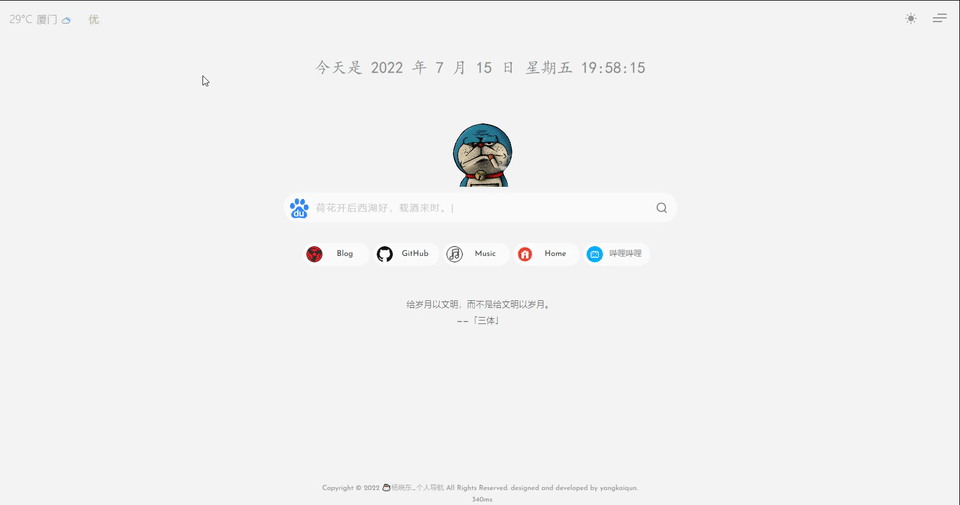
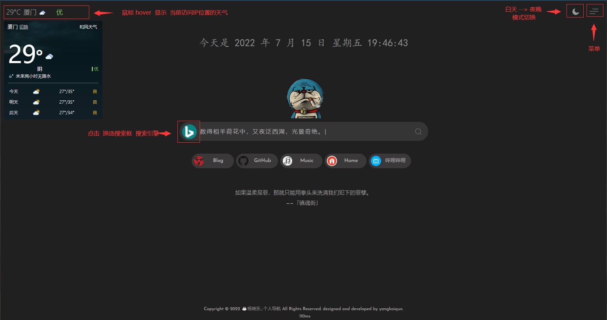

# 个人导航页——带搜索  

用惯了各种导航首页，满屏幕尽是各种不厌其烦的广告和资讯；

尝试自己写个自己的主页。

不是镜像不是代理，就当做浏览器主页使用，支持自适应屏幕。  

##  GIF示例效果:

### 白天模式

### 暗夜模式
   

## 下载地址：  

[杨晓东版_Releases](https://github.com/Victor4430/html_home-page-serch/releases)

## 俺的示例页面 & 原作者源码：    

+ html+js+css版本：[https://demo443.com/](https://demo443.com/) 
+ html+js+css源码：[https://github.com/HolgerHuo/minimalist-search](https://github.com/HolgerHuo/minimalist-search)  

## 组件：  

### 图标：
图标调用了阿里的图标`https://www.iconfont.cn/`，提供下本地包[点击下载](https://cdn.jsdelivr.net/gh/5iux/sou/icon.zip)  
嫌麻烦的可以使用js版本示例里面的`font-awesome`  

### 天气组件  

[天气API地址](https://dev.qweather.com/)

## 其他
我这个只是个人偏好，有需求还是自己改；

上谷歌大家还是自备梯子吧，这里不提供了。  

关于百度搜索出来百家号的问题大家可以搜一下油猴脚本，或者在关键词后面加入`-baijiahao`参数。

其实  俺只是个搬运工  嘿嘿 (*^▽^*)
